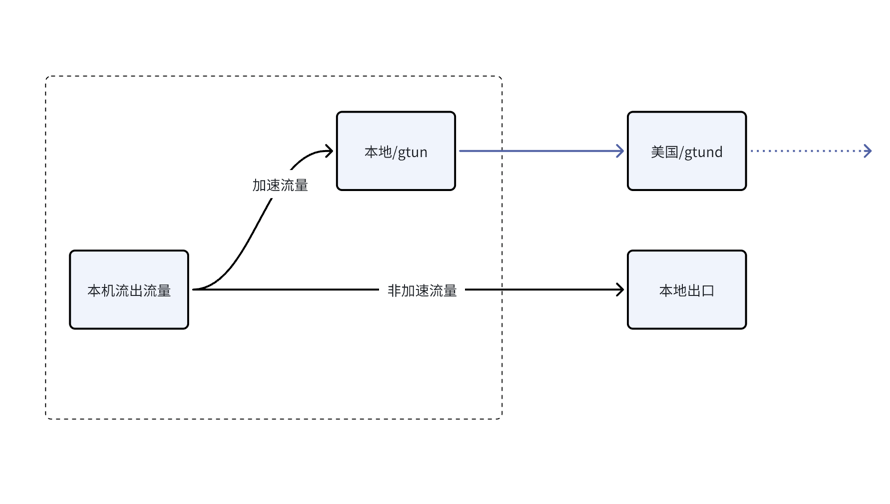

# 最佳实践: 基于gtun+ipset实现ip代理加速和分流
gtun的基础功能是ip加速，本文通过具体的配置来讲解如何配置gtun的ip加速功能，最终实现的效果是除了局域网IP之外，访问其他所有IP都通过gtun转发到美国出口。
最终拓扑如下：



如图所示，本文会包含两个部分：
- 本地gtun，美国gtund的部署
- 加速流量和非加速流量的区分，这部分通过ipset和iptables来进行

我们可以通过iptables非常灵活的控制加速和非加速流量。

**本文是基于gtun的2.0.7版本。**

# 安装
安装包括两个组件：
- gtund：ip加速的服务端程序，部署在美国
- gtun：ip加速的客户端程序，部署在本地linux

## 安装gtund
在release里面找到2.0.7版本的产物并进行下载，gtund部署在美国的AWS上。

```
cd gtund
./install.sh
```
install.sh 会创建gtund的运行目录，并通过systemd把gtund程序拉起。
执行install.sh完成之后，gtund会：
- 监听tcp的3002作为mux协议的服务端口
- 监听udp的3002作为kcp协议的服务端口
- 日志记录在/opt/apps/gtund/logs/gtund.log

gtund的默认配置为，默认情况下不需要作任何的修改即可

```yaml
enable_auth: true
auths:
  - access_token: "ICKelin:free"
    expired_ath: 0

trace: ":3003"
server:
  - listen: ":3002"
    scheme: "kcp"

  - listen: ":3002"
    scheme: "mux"

log:
  days: 5
  level: "debug"
  path: "/opt/apps/gtund/logs/gtund.log"

```

您也可以使用docker-compose来进行安装：

```shell
cd gtund
docker-compose up --build -d
```

执行完之后docker ps 看是否启动成功

## 安装gtun

gtun的安装也类似，在release里面找到2.0.7版本的产物并进行下载，然后在本地linux上进行部署

```shell
cd gtun
export ACCESS_TOKEN="ICKelin:free"
export SERVER_IP="gtund所在的服务器的ip"
./install.sh
```

安装完成之后查看是否有错误日志

```shell
tail -f /opt/apps/gtun/logs/gtun.log
```

同样，你也可以使用docker-compose来安装

```shell
cd gtun
docker-compose up --build -d
```

执行完成之后docker ps 看是否启动成功。

# 配置转发规则
本文的转发规则比较简单，需要加速的地址为`0.0.0.0/0`，不需要加速的地址列表在gtun/scripts/noproxy.txt文件里面，主要包含一些局域网地址，
需要记住的是，**一定要把gtund的公网IP加入到noproxy.txt里面**，防止自己把服务器地址拦截。

第一步把不需要的加速的地址配置好：
```shell

noproxy_set=NOPROXY

clear_noproxy() {
    iptables -t mangle -D PREROUTING -m set --match-set $noproxy_set dst -j ACCEPT
    iptables -t mangle -D OUTPUT -m set --match-set $noproxy_set dst -j ACCEPT
    ipset destroy $noproxy_set >/dev/null
}

add_noproxy() {
  ipset create $noproxy_set hash:net
  cat noproxy.txt | while read line
  do
      echo "no proxy for" $line
      ipset add $noproxy_set $line
  done

  iptables -t mangle -A PREROUTING -m set --match-set $noproxy_set dst -j ACCEPT
  iptables -t mangle -A OUTPUT -m set --match-set $noproxy_set dst -j ACCEPT
}
```

通过创建NOPROXY的ipset并且把noproxy.txt文件的cidr列表加入进去，然后通过iptables匹配到NOPROXY这个ipset的地址全部ACCEPT掉。

第二步把需要加速的地址配置好:

```shell
setname=GTUN_ALL
redirect_port=8524

add_proxy() {
  ipset create $setname hash:net
  echo "proxy for 0.0.0.0/1"
  echo "proxy for 128.0.0.0/1"
  ipset add $setname 0.0.0.0/1
  ipset add $setname 128.0.0.0/1

  iptables -t mangle -A PREROUTING -p tcp -m set --match-set $setname dst -j TPROXY --tproxy-mark 1/1 --on-port $redirect_port
  iptables -t mangle -A PREROUTING -p udp -m set --match-set $setname dst -j TPROXY --tproxy-mark 1/1 --on-port $redirect_port
  iptables -t mangle -A OUTPUT -m set --match-set $setname dst -j MARK --set-mark 1

  # redirect dns query
#  iptables -t mangle -A PREROUTING -p udp --dport 53 -j TPROXY --tproxy-mark 1/1 --on-port $redirect_port
#  iptables -t mangle -A OUTPUT -p udp --dport 53 -j MARK --set-mark 1

  ip rule add fwmark 1 lookup 100
  ip ro add local default dev lo table 100
}

```

通过创建GTUN_ALL的ipset并且把`0.0.0.0/1`和`128.0.0.0/1`加入到其中。然后通过iptables打mark和策略路由来实现访问GTUN_ALL这个ipset的cidr地址的流量的劫持。

通过上面两个步骤，由于iptables使用的是-A的方式添加到表尾部，所以会先匹配noproxy_set，noproxy_set匹配不到再匹配到GTUN_ALL。

以上两个步骤的脚本已经打包进`gtun/scripts/redirect_all.sh`文件里面，有需要可以根据具体情况进行修改。

上面是实现的所有流量加速的，但是有时候我们需要部分不加速，比如大陆地区的ip访问不加速，那么只需要把大陆地区的ip加入到noproxy这一ipset即可。

```shell
wget https://raw.githubusercontent.com/herrbischoff/country-ip-blocks/master/ipv4/cn.cidr
cat cn.cidr | while read line
  do
      echo "no proxy for" $line
      ipset add $noproxy_set $line
  done
```

用法非常多，后续文章会不断分享一些用法。

# 测试
最后来进行一次简单的测试，首先是不加速的验证，这里我用我的一个服务器的ip来进行测试。

```shell
# 将ip加入到NOPROXY ipset当中
ipset add NOPROXY xx.xx.xx.xx

# ssh 连接ip
ssh root@xx.xx.xx.xx

# 使用who命令查看当前连接的ip
root@iZwz97kfjnf78copv1ae65Z:~# who
root     tty1         Jun 28 10:41
root     pts/0        Apr 28 09:43 (119.139.xx.xx)
```

最终结果走的是本地的出口(119.139.xx.xx)。

同样的方式，把这个ip从NOPROXY ipset中删除，加入到GTUN_ALL这个匹配走加速的ipset当中。

```shell
ipset del NOPROXY xx.xx.xx.xx
ipset add GTUN_ALL xx.xx.xx.xx

root@iZwz97kfjnf78copv1ae65Z:~# who
root     tty1         Jun 28 10:41
root     pts/1        Apr 28 09:46 (3.141.xx.xx)
```

最终走的是加速的出口（3.141.xx.xx）

# 结束语
以上是gtun的最基本的功能，实现所有流量劫持并进行加速，同时也提了一嘴如何访问大陆地区的ip不加速，通过这个实例基本上能了解gtun是如何跑起来的，也能定制一些更加适合自己的用法。
后续会继续介绍如何通过gtun跟dnsmasq结合实现访问域名的加速。